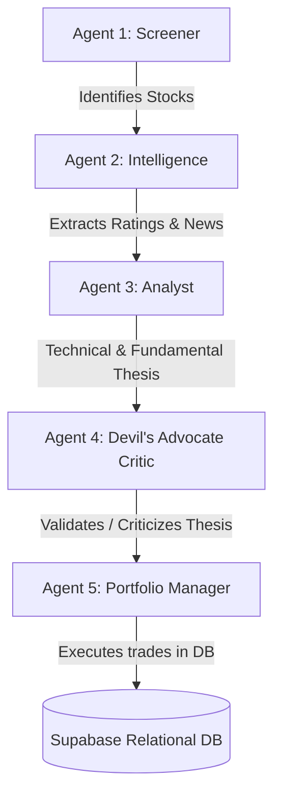

# 📈 Stock Genie

An autonomous, multi-agent stock trading paper-portfolio manager for the Indian Stock Market (NSE) built with Python, Streamlit, Groq API, and Supabase.

### 🔗 Live Dashboard
Deploy Link: [stock-genie.streamlit.app](https://stock-genie.streamlit.app)

---

## 🧠 Multi-Agent Pipeline Architecture

Stock Genie simulates a professional trading desk using five specialized AI agents running on the fast **Llama 3.1 8B** model:



1.  **Agent 1: The Screener**: Scrapes financial news across 15 domestic and foreign brokerage firms using Tavily to identify stocks with strong institutional momentum.
2.  **Agent 2: The Intelligence Agent**: Extracts sentiment and target prices from institutional consensus data.
3.  **Agent 3: The Analyst**: Analyzes technical data (SMA, EMA, RSI, MACD, returns) and fundamental indicators to formulate a BUY, SELL, or HOLD thesis.
4.  **Agent 4: The Critic**: Acts as a devil's advocate, attempting to poke holes in the Analyst's thesis based on core trading philosophies.
5.  **Agent 5: The Portfolio Manager**: Weighs the Analyst's data against the Critic's rebuttals, applies position sizing and sector limits, and issues a final trade execution order.

---

## 🗄️ Database Setup (Supabase)

This project uses a relational Supabase schema to store portfolio states and execute paper trades:

*   **`portfolio`**: Tracks available cash, total portfolio value, net P&L, and trade count.
*   **`holdings`**: Tracks active stock positions (`ticker`, `avg_price`, `qty`, `current_price`, `current_value`, `unrealized_pnl`).
*   **`trades`**: Records execution log history (`ticker`, `action`, `price`, `qty`, `realized_pnl`, `reasoning`).

The database syncs automatically and pulls real-time market prices from `yfinance` on every page load to calculate unrealized returns.

---

## 🚀 Getting Started

### 1. Prerequisites
Ensure you have Python 3.10+ installed.

### 2. Install Dependencies
```bash
pip install -r requirements.txt
```

### 3. Setup Environment Variables
Create a `.env` file in the root folder:
```ini
GROQ_API_KEY="your_groq_key"
TAVILY_API_KEY="your_tavily_key"
SUPABASE_URL="https://your-project.supabase.co"
SUPABASE_KEY="your_supabase_service_role_key"
```

### 4. Run the Dashboard locally
```bash
python -m streamlit run app.py
```